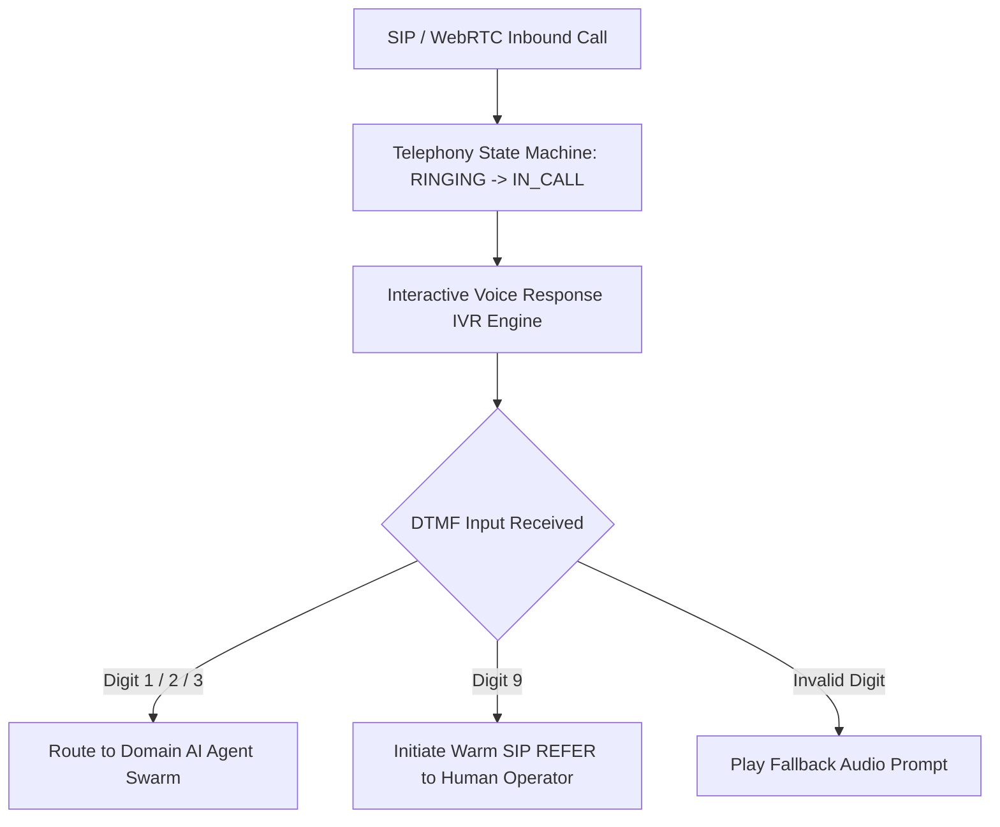

# GenPark AI Agent Skill - Voice Call DTMF & SIP Telephony Router

PSTN/SIP voice telephony state machine managing DTMF tone recognition, IVR routing trees, and automated warm transfer handoffs.

Verified by [GenPark AI](https://genpark.ai) and compatible with [Model Context Protocol (MCP)](https://genpark.ai/mcp).

## Architecture Diagram

## Features
- **Robust Telephony FSM**: Deterministically handles call states (`RINGING`, `IN_CALL`, `WARM_TRANSFERRING`, `TERMINATED`).
- **DTMF Tone Parsing**: Maps dial-pad inputs to multi-agent workflows.
- **Zero External Dependencies**: Standard library Python 3.9+.
